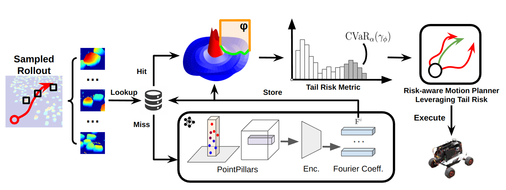
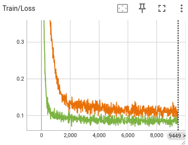
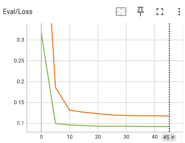
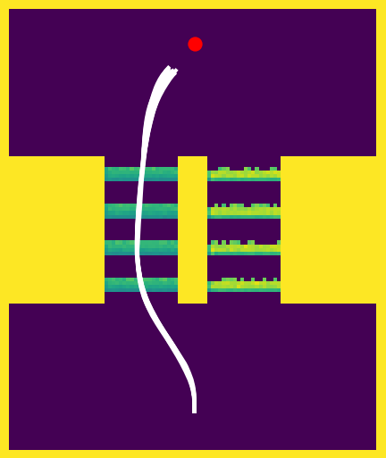
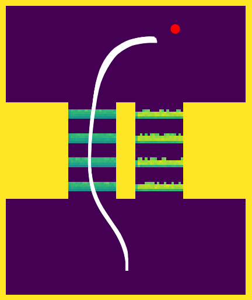
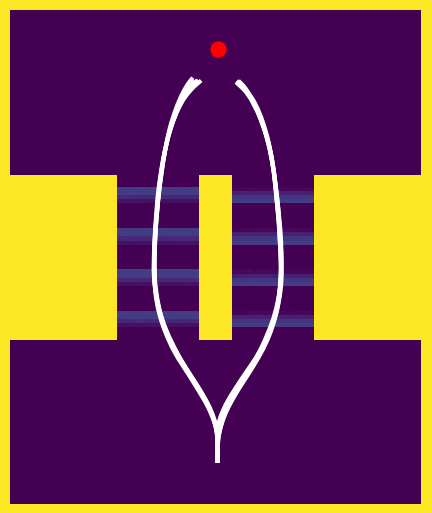
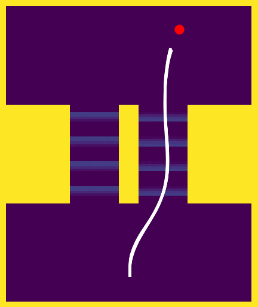

# SPARTA: Learning Smooth State-Dependent Traversability from Dense Point CLouds

<span class="author-block">
    <a href="https://zhdphilip.github.io/">Zihao Dong</a><sup>1</sup>,
</span>
<span class="author-block">
    <a href="https://alanpapalia.github.io/">Alan Papalia</a><sup>12</sup>,
</span>
<span class="author-block">
    <a href="https://scholar.google.com/citations?user=Y2Ge54EAAAAJ&hl=en">Leonard Jung</a><sup>1</sup>,
</span>
<span class="author-block">
    <a href="https://scholar.google.com/citations?user=mg5AwucAAAAJ&hl=en&oi=ao">Alenna Spiro</a><sup>1</sup>,
</span>
<span class="author-block">
    <a href="https://scholar.google.com/citations?user=IcbuLWkAAAAJ&hl=en">Philip R. Osteen</a><sup>3</sup>,
</span>
<span class="author-block">
    <a href="https://openreview.net/profile?id=~Christa_S._Robison1">Christa S. Robison</a><sup>3</sup>,
</span>
<span class="author-block">
    <a href="https://neu-autonomy.github.io/lab_website/">Michael Everett</a><sup>1</sup>
</span>

<sup>1</sup>Northeastern Univeristy, <sup>2</sup>University of Michigan, Ann Arbor  
<sup>3</sup> DEVCOM Army Research Laboratory (ARL)

Official Repository for CoRL 2025 paper: [Learning Smooth State-Dependent Traversability from Dense Point Clouds](https://arxiv.org/pdf/2506.04362).

## Updates
- Code: Our code for training pipeline, model checkpoints, and a simulated experiment with unicycle dynamics, has been released!

## About
In our paper **SPARTA**, we propose a novel method to predict traversability conditioned on vehicle approach angle, and a dense point cloud representation of the terrain. Instead of directly encoding the approach angle as model input, our model takes in the point cloud and predicts an analytical function (represented using Fourier basis functions) that maps angle of approach to the target risk variable distribution. The function, once computed for a terrain patch, can be queried efficiently with
minimal computation overhead for any angle of approach at any timestep when integrated with modern planners
like MPPI. This repositiory contains the official training pipeline, model checkpoints, and a simulated experiment using unicycle dynamics. 

</br>
<p align='center'>
    <video controls autoplay loop muted playsinline width="720">
        <source src="./asset/CoRL_Spotlight_Video.mp4" type="video/mp4">
        Download the video above if it doesn’t play.
    </video> </br>
    
</p>

## Installation
1. Clone this repository:
```bash
git clone git@github.com:neu-autonomy/SPARTA.git
```

2. Dependencies:
- Install dependencies using mamba (recommanded) or conda:
```bash
mamba env create -f sparta_environment.yml
```
- and install [pointpillars backbone](https://github.com/zhulf0804/PointPillars?tab=readme-ov-file#install):
```bash
python setup.py build_ext --inplace
pip install .
```
- **Important:** A common failure when installing the pointpillars backbone is a CUDA version mismatch. To 
solve the problem, make sure your installed pytorch version uses the **SAME** cuda version as in your system
level. For example, if your system level cuda is 11.8, make sure to install pytorch 2.x.x+cu118.

## Dataset

Our dataset can be downloaded at: [google drive](https://drive.google.com/file/d/1VMmWyQ_ksL-tIpy2Lo-wDjLWZEKfvsBo/view?usp=sharing).
After downloading the dataset, unzip and place the folder under `SPARTA/beamng_dataset`.

Expected directory structure:
```
SPARTA \
- beamng_dataset\
- - tech_ground_deformation_distribution_raw\
- - - train\
- - - - ...
- - - test\
- - - - ...
```

## Training
Start training by running:
```bash
# For angle-conditioned model: 
python3 train_terrain_traversability_with_angle.py --config config/tire_deformation_fouer_new.yaml

# For angle-free model:
pythoh3 train_terrain_traversability_angle_free.py --config config/tire_deformation_angle_free.yaml
```
The config files for the hyperparameters can be found under the folder `SPARTA/config`. Note re-running training with
same config files will override checkpoints saved in `SPARTA/checkpoints/{experiment_name}`.

The training progress is logged via `tensorboard`, whose logdir is specified in the config files under train -> logdir. 
(Note: we improved the training pipeline for AngleInput and managed to achieve a ~0.015 lower test EMD2 loss as reported
in the initial manuscript)

</br>

<p align='center'>
    
    
</p>


## Evaluation on Unicycle
We have re-created the environment for our hardware experiment using a simplified unicycle dynamics model.

- First [download](https://drive.google.com/drive/folders/1B_7xh2c8yy_2D0IHtr1CJp4Ii0SI42SQ?usp=sharing) 
the dense point cloud of the obstacles. The google drive folder also contains the coefficient/elevation maps
we generated with our trained checkpoints. The files should be placed under `SPARTA/example`.

- To run the example:
```bash
# Precompute the Fourier coefficients and elevation map
python3 -m example.precompute_coefficients

# Running simulated experiments using MPPI + Unicycle
python3 -m example.mppi_unicycle
```

- Expected output using our checkpoint (tire_deformation_fourier_new): While our model consistently identifies 
the safe path (left) in all 10 trials, the elevation baseline treats the passage ways as equally risky, 
and consistently choose the risky path then the goal is to its right.

</br>
<p align='center'>
    
    
    &nbsp;&nbsp;&nbsp;&nbsp;&nbsp;
    
    
</p>

## Citation
```bibtex
@article{dong2025learning,
  title={Learning Smooth State-Dependent Traversability from Dense Point Clouds},
  author={Dong, Zihao and Papalia, Alan and Jung, Leonard and Spiro, Alenna and Osteen, Philip R and Robison, Christa S and Everett, Michael},
  journal={arXiv preprint arXiv:2506.04362},
  year={2025}
}
```

## Acknowledgement
Our backbone is built from the [pointpillars](https://github.com/zhulf0804/PointPillars). 